# Ex-09-Data-Visualization-

## AIM
To Perform Data Visualization on a complex dataset and save the data to a file. 

# Explanation
Data visualization is the graphical representation of information and data. By using visual elements like charts, graphs, and maps, data visualization tools provide an accessible way to see and understand trends, outliers, and patterns in data.

# ALGORITHM
### STEP 1
Read the given Data
### STEP 2
Clean the Data Set using Data Cleaning Process
### STEP 3
Apply Feature generation and selection techniques to all the features of the data set
### STEP 4
Apply data visualization techniques to identify the patterns of the data.


# CODE

Developed by : Arshatha

Register number : 212222230012

```py
Data Preprocessing

import seaborn as sns
import pandas as pd
import matplotlib.pyplot as plt
df = sns.load_dataset("tips")
print(df)

df.isnull().sum()

Handling Outliers
plt.figure(figsize=(8,8))
plt.title("Data with Outliers")
df.boxplot()
plt.show()

Removing Outliers
plt.figure(figsize=(8,8))
cols = ['size','tip','total_bill']
Q1 = df[cols].quantile(0.25)
Q3 = df[cols].quantile(0.75)
IQR = Q3 - Q1
df = df[~((df[cols] < (Q1 - 1.5 * IQR)) |(df[cols] > (Q3 + 1.5 * IQR))).any(axis=1)]
plt.title("Dataset after removing outliers")
df.boxplot()
plt.show()

1) Which day of the week has the highest total bill amount?
sns.barplot(x=df['day'], y=df['total_bill'], hue=df['day'])
plt.legend(loc="center")
plt.title("Highest Total Bill Amount by day of the week")
plt.show()

2) What is the average tip amount given by smokers and non-smokers?
sns.boxplot(x=df['smoker'], y=df['tip'], hue=df['smoker'])
plt.title("Average Tip Amount given by smokers and non-smokers")

3) How does the tip percentage vary based on the size of the dining party?
df["tip_percent"] = df["tip"] / df["total_bill"]
sns.scatterplot(x=df['size'],y=df['tip_percent'],data=df)
plt.title("Tip Percentage by Dining Party Size")

4) Which gender tends to leave higher tips?
sns.boxplot(x=df['sex'], y=df['tip'],hue=df['sex'])
plt.title("Tips based on gender")

5) Is there any relationship between the total bill amount and the day of the week?
sns.scatterplot(x=df['day'],y=df['total_bill'],hue=df['day'])
plt.legend(loc="best")
plt.title("Total bill amount by day of the week")

6) How does the distribution of total bill amounts vary across different time periods (lunch vs. dinner)?
sns.histplot(data=df, x="total_bill", hue="time", element="step", stat="density")
plt.title("Distribution of Total Bill Amounts by Time of Day")
plt.show()

7) Which dining party size group tends to have the highest average total bill amount?
sns.barplot(x=df['size'],y=df['total_bill'],hue=df['size'])
plt.title("Average Total Bill Amount by Dining Party Size")
plt.show()

8) What is the distribution of tip amounts for each day of the week?
sns.boxplot(x="day", y="tip", data=df)
plt.title("Tip Amount by Day of Week")
plt.show()

9) How does the tip amount vary based on the type of service (lunch vs. dinner)?
sns.violinplot(x="time", y="tip", data=df)
plt.title("Tip Amount by Time of Day")
plt.show()

10) Is there any correlation between the total bill amount and the tip amount?
sns.scatterplot(x="total_bill", y="tip", data=df)
plt.title("Correlation between Tip Amount and Total Bill Amount")
plt.show()
```

# OUTPUT
Data Preprocessing

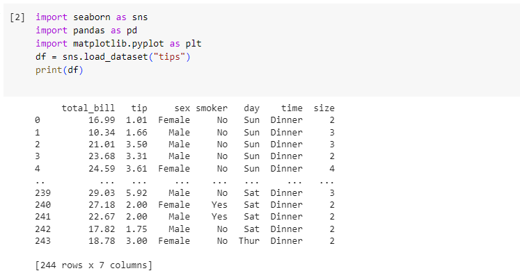

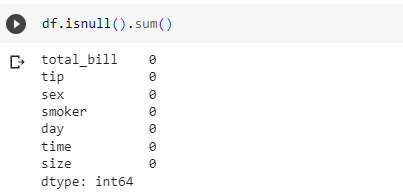

Handling Outliers

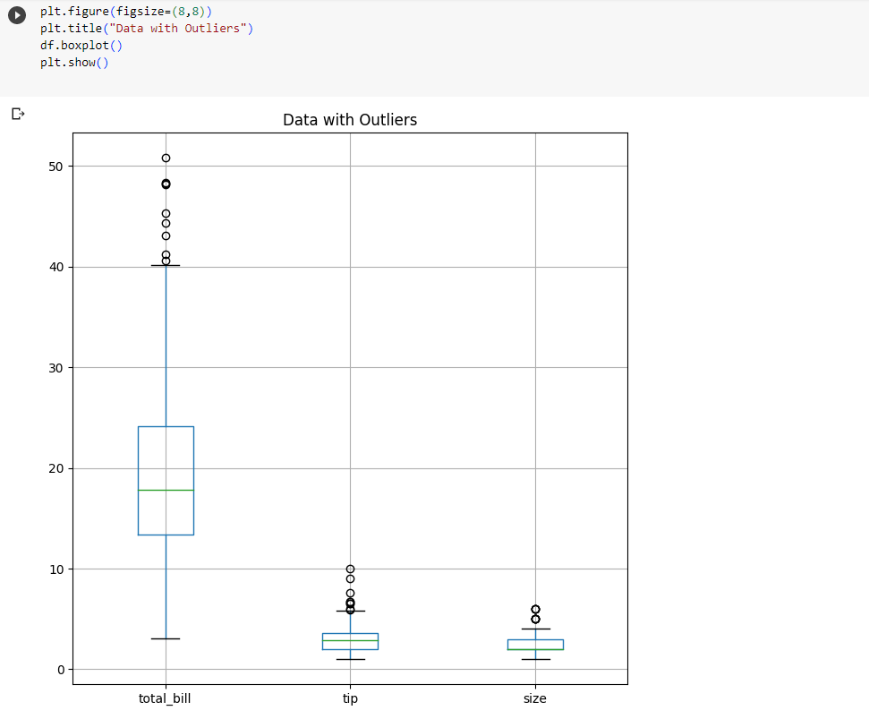

Removing Outliers

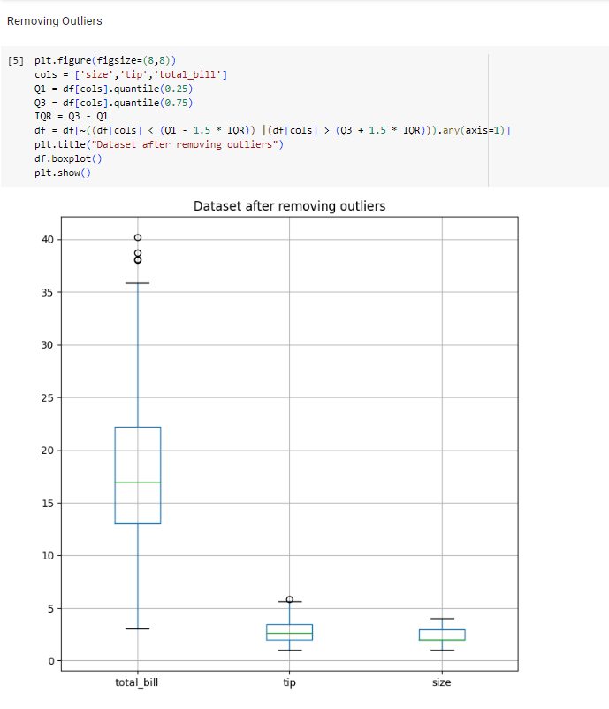

1) Which day of the week has the highest total bill amount?

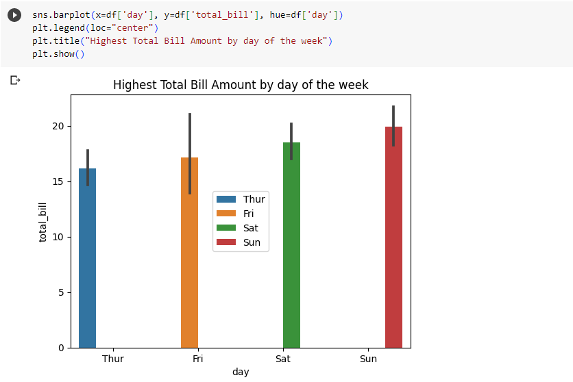

2) What is the average tip amount given by smokers and non-smokers?

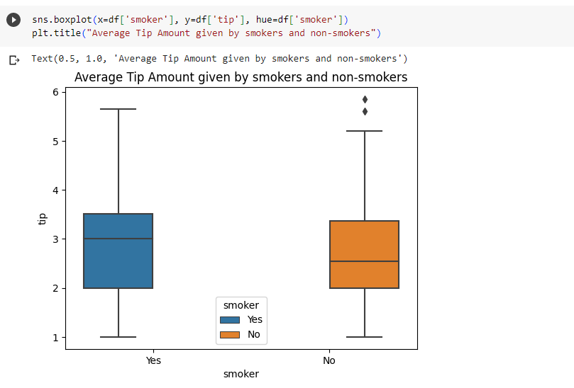

3) How does the tip percentage vary based on the size of the dining party?

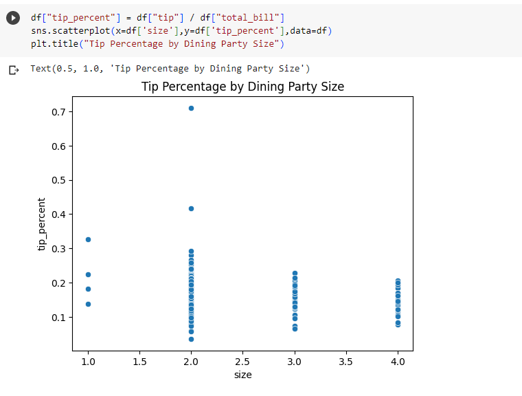

4) Which gender tends to leave higher tips?

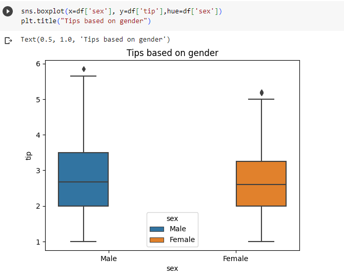

5) Is there any relationship between the total bill amount and the day of the week?

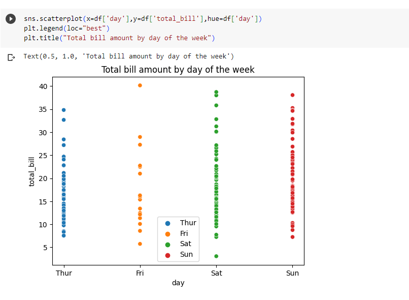

6) How does the distribution of total bill amounts vary across different time periods (lunch vs. dinner)?

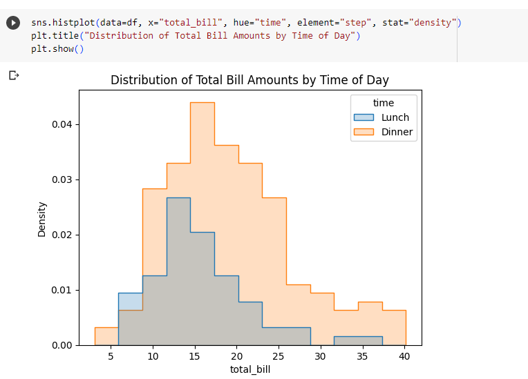

7) Which dining party size group tends to have the highest average total bill amount?

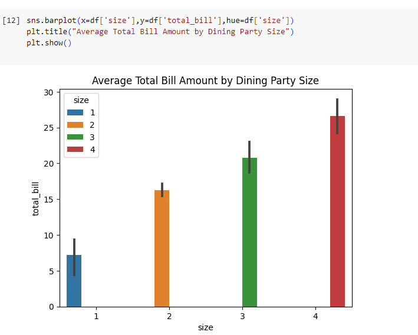

8) What is the distribution of tip amounts for each day of the week?

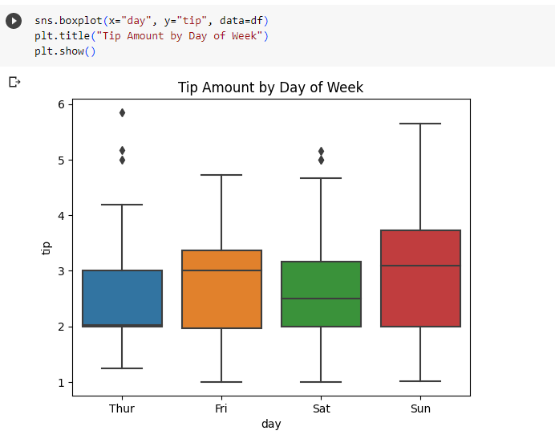

9) How does the tip amount vary based on the type of service (lunch vs. dinner)?

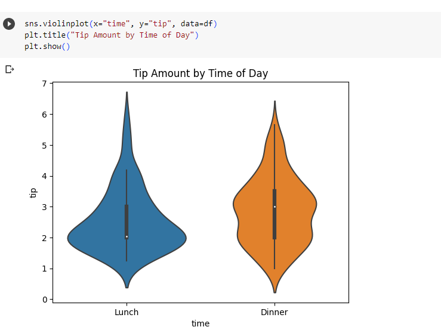

10) Is there any correlation between the total bill amount and the tip amount?

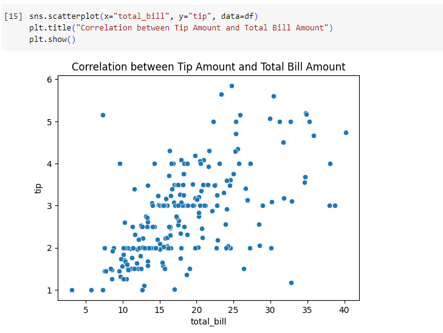

# RESULT

Thus the Data Visualization method is performed to the given data and to predict the outcome for the given questions.
